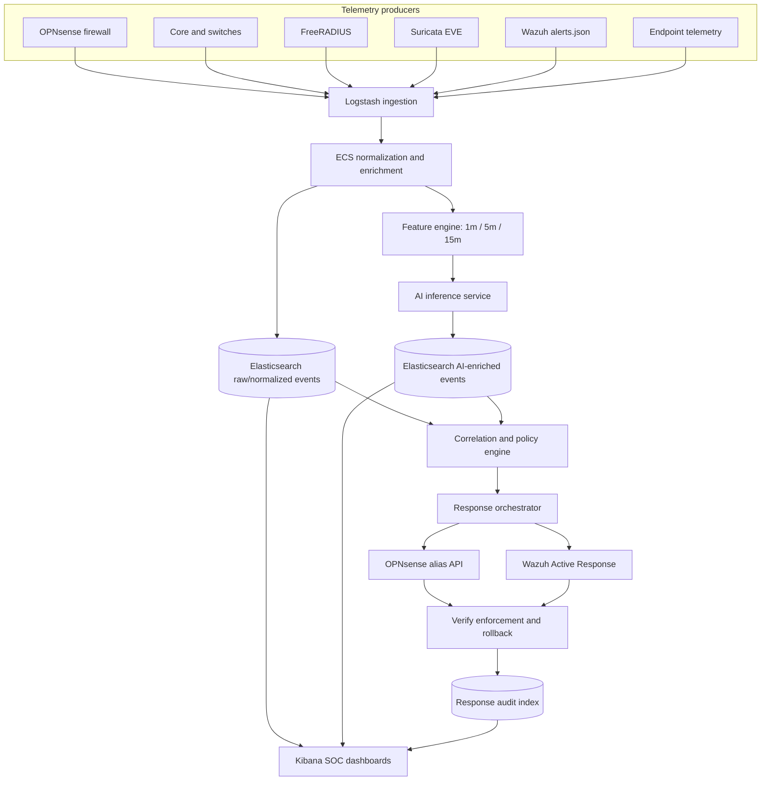

# SOC/AI closed-loop architecture

## Mission

Evolve the repository from network-security IaC with compliance evidence into
an automated SOC and AI-assisted detection-and-response platform. The existing
network remains the source of isolation, realistic telemetry, and controlled
attack scenarios. It is not replaced by the SOC layer.

The operating loop is:

```text
Detect -> Analyze -> Decide -> Respond -> Verify -> Learn
```

Phase 1 defines contracts only. Elasticsearch, Logstash, Kibana, model
services, and response adapters are introduced in later phases and must not be
reported as runtime-validated until their corresponding gates pass.

## Canonical data flow



Elasticsearch and Kibana form the SOC analytics plane. Wazuh Manager remains
the endpoint HIDS, static-rule, FIM, and Active Response engine. Wazuh events
enter the analytics plane from `alerts.json`; Suricata, OPNsense, RADIUS, and
network-device telemetry enter Logstash directly. AI therefore sees normalized
raw events as well as static-rule alerts and is not trained only on events that
Wazuh already selected.

## Trust boundaries

| Zone | Assets | Trust rule |
|---|---|---|
| Telemetry producers | sensors, endpoints, firewalls, AAA, network devices | Events are untrusted input; producers cannot write arbitrary analytics fields. |
| Ingestion | Logstash inputs, parsers, DLQ | Authenticate sources, bound payloads, preserve originals, and route malformed data without stopping a pipeline. |
| Analytics | Elasticsearch and Kibana | TLS only, persistent data, least-privilege service identities, and no direct public Elasticsearch exposure. |
| AI | feature workers, registry, inference API | Models consume versioned feature contracts and return scores; they hold no firewall or endpoint credentials. |
| Decision | correlation and policy engine | An anomaly alone never authorizes containment. A second independent signal is required. |
| Privileged response | orchestrator and adapters | Credentials are scoped per adapter; every create, verify, revert, failure, and expiry becomes an audit event. |
| Analyst | Kibana and approval workflow | Human access is authenticated and cannot bypass response policy or provenance checks. |

The Suricata capture interface has no management address. Management uses a
separate VLAN 99 interface. Routed and mirrored East-West traffic are explicit
inputs to the sensor design; an Internet-uplink mirror alone is insufficient.

## Canonical event and storage contracts

All normalized events conform to `schemas/ecs/soc-event.schema.json`. Required
metadata records the schema version, sensor, zone, VLAN, asset role, dataset,
and ingestion identity. ECS fields such as `source.ip`, `destination.ip`,
`event.category`, `event.dataset`, `network.*`, `host.*`, and `user.*` are used
where applicable.

Logical data streams are separated by purpose:

- `soc-events-*`: immutable raw and normalized telemetry;
- `soc-features-*`: reproducible window features;
- `soc-ai-*`: scores, thresholds, model identity, and inference latency;
- `soc-response-*`: decisions, enforcement verification, expiry, and rollback;
- `soc-malformed-*`: rejected input with parser error metadata.

The feature contract is versioned independently from the event contract.
Dataset, feature-schema, model, Git revision, random seed, hyperparameters,
threshold, and train/test windows are hashed or recorded before a model may be
promoted.

## Detection and response invariant

The MVP decision policy is fail-closed:

```text
score < 0.75                  -> store only
0.75 <= score < 0.90         -> alert an analyst
score >= 0.90 + second signal -> eligible for automatic response
```

Valid second signals include a Suricata alert, high-severity Wazuh alert,
repeated authentication failures, threat-intelligence match, or known
protected-asset context. Eligibility still requires an allowlist check, TTL,
rate limit, deduplication, rollback plan, and append-only response audit.

OPNsense containment uses the `SOC_BLOCKLIST` alias and updates both HA peers;
the orchestrator verifies both before reporting success. Endpoint containment
uses a controlled Wazuh Active Response adapter. AI services cannot call either
adapter directly and cannot execute arbitrary shell commands.

## Scientific evaluation

The detector order is static rules, Isolation Forest, static plus Isolation
Forest, LSTM autoencoder, then static plus LSTM. Dataset splits are temporal,
not random by event. Required comparison metrics are Precision, Recall, F1,
PR-AUC, false positives per hour, MTTD, containment/response time, event rate,
p95 inference latency, CPU, and RAM. Accuracy is not a primary metric for the
imbalanced anomaly dataset.

## Delivery gates

1. Ingestion: each required source produces a real Elasticsearch event and the
   SOC dashboard reads it.
2. AI baseline: reproducible features drive Isolation Forest inference and
   scores return to Elasticsearch; no automatic block is enabled.
3. Evaluation: benign and controlled-attack data use a leakage-safe temporal
   split and regenerate all benchmark tables.
4. Response: correlation-gated create/verify/revert lifecycles pass with TTL,
   allowlist, deduplication, rate limit, and audit evidence.
5. Network fidelity: OPNsense HA, Core L3/SPAN, VLAN 30/40/50/99, and AAA
   generate the expected visibility and isolation evidence.
6. Audit-grade release: provenance, loss/DLQ, detection latency, response HA,
   adversarial, and false-positive experiments are reproducible.
